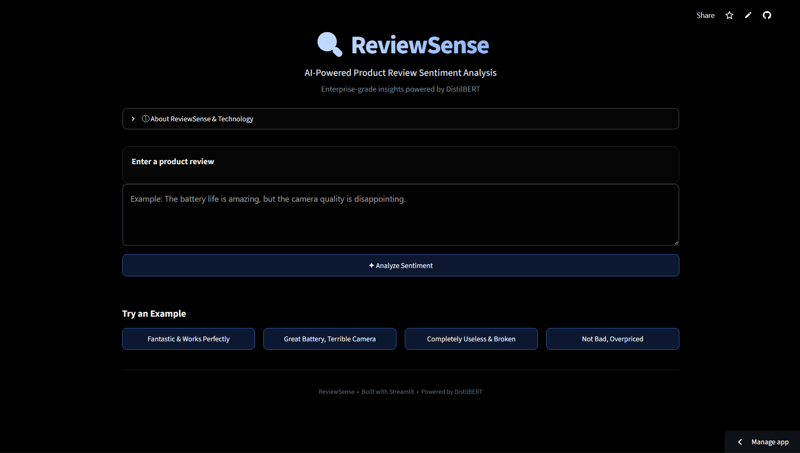
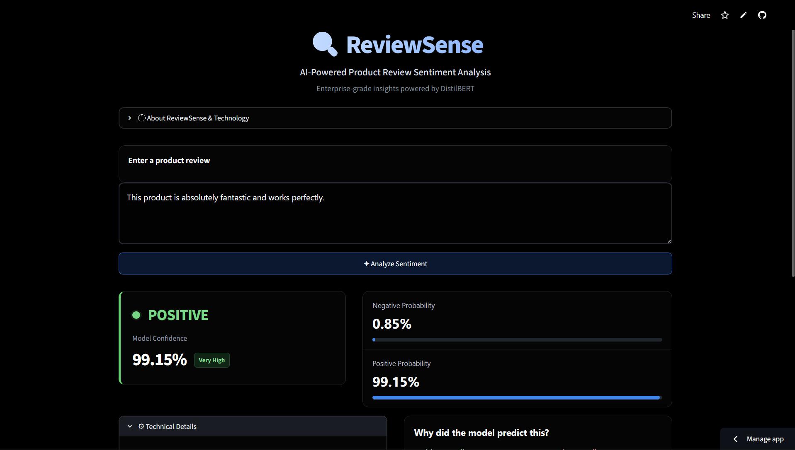
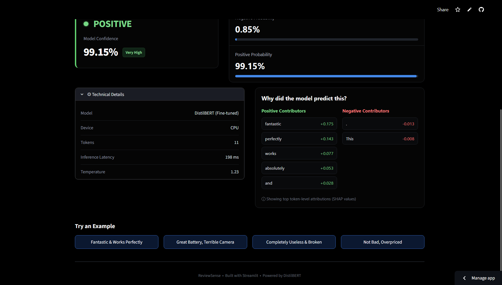

# ReviewSense

**ReviewSense** is an end-to-end NLP system for product review sentiment analysis, combining a fine-tuned **DistilBERT** classifier with probability calibration, **SHAP-based explainability**, error analysis, and detailed model evaluation.

A **TF-IDF + Logistic Regression** model is also implemented as a baseline for comparison.

## Live Demo

[Try ReviewSense](https://reviewsense-gvb78kk5seudcfjkgqcdem.streamlit.app/)
---

## Overview

ReviewSense analyzes the sentiment expressed in product reviews while providing both predictions and insights into model behavior.

The system includes:

- Fine-tuned DistilBERT sentiment classification
- TF-IDF + Logistic Regression baseline
- Probability calibration using temperature scaling
- SHAP-based model explanations
- Error and subgroup analysis
- Confidence and probability reporting
- Interactive Streamlit application
- Saved model artifacts for standalone inference

---

## Model Performance

### Overall Performance

| Metric | TF-IDF + Logistic Regression | DistilBERT |
|:---|---:|---:|
| Accuracy | 90.81% | **93.18%** |
| Precision | 90.58% | **93.61%** |
| Recall | 91.59% | **93.06%** |
| F1 Score | 91.08% | **93.33%** |

DistilBERT outperforms the TF-IDF baseline across all reported metrics, demonstrating the benefit of transformer-based contextual representations for sentiment classification.

### Final DistilBERT Results

| Metric | Score |
|:---|---:|
| Accuracy | **93.28%** |
| Precision | **93.55%** |
| Recall | **93.33%** |
| F1 Score | **93.44%** |

---

## Calibration

The model uses **temperature scaling** to improve the reliability of its predicted probabilities.

| Metric | Before Calibration | After Calibration |
|:---|---:|---:|
| Brier Score | 0.0572 | **0.0553** |

**Temperature:** 1.2288

The lower Brier Score after calibration indicates an improvement in probabilistic calibration.

---

## Error Analysis

The final model produced:

- **Total errors:** 336
- **Error rate:** 6.72%
- **Negative → Positive:** 165
- **Positive → Negative:** 171

### High-Confidence Errors

| Confidence Threshold | Errors | % of All Errors |
|:---|---:|---:|
| ≥ 0.90 | 219 | 65.18% |
| ≥ 0.95 | 191 | 56.85% |
| ≥ 0.99 | 80 | 23.81% |

This analysis highlights cases where the model remains highly confident despite making an incorrect prediction.

---

## Subgroup Performance

| Subgroup | Accuracy |
|:---|---:|
| Short Review (≤20 words) | 93.10% |
| Medium Review (21–50 words) | **93.96%** |
| Long Review (>50 words) | 92.98% |
| No Negation | **94.74%** |
| Contains Negation | 92.56% |

The subgroup analysis shows a small performance drop on reviews containing negation, making negation an important area for further analysis.

---

## Explainability

ReviewSense uses **SHAP (SHapley Additive exPlanations)** to identify which tokens contribute to a prediction.

For example, for a review such as:

> "I loved the battery life, but the phone overheats constantly."

the model predicts **Negative**, with the word **"but"** receiving a strong contribution toward the negative prediction.

The system provides:

- Top influential tokens
- SHAP contribution values
- Features pushing toward the predicted class
- Features pushing away from the predicted class
- Visual SHAP explanations

This makes the model's predictions easier to inspect and interpret.

---

## Live Inference

The trained model can be used to analyze new reviews and returns:

- Predicted sentiment
- Raw model confidence
- Calibrated confidence
- Negative probability
- Positive probability
- Confidence level

Example:

```text
Review:
The product is amazing and I would definitely recommend it.

Sentiment   : POSITIVE
Confidence  : 99.07%

Negative    : 0.93%
Positive    : 99.07%
```
---


## 📸 Application

### Review Input


### Sentiment Prediction


### Model Explainability


The ReviewSense application provides an interactive interface for entering
product reviews, analyzing sentiment, viewing calibrated probabilities and
model confidence, and inspecting token-level SHAP explanations.

---

##  Tech Stack

- Python
- PyTorch
- Hugging Face Transformers
- DistilBERT
- SHAP
- Scikit-learn
- Streamlit
- NumPy
- Pandas

---

## 📁 Project Structure

```text
ReviewSense/
├── app.py                         # Streamlit application
├── requirements.txt               # Python dependencies
├── README.md                      # Project documentation
├── .gitignore
├── assets/
│   ├── reviewsense-home.png
│   ├── reviewsense-prediction.png
│   └── reviewsense-explainability.png
│
├── data/
│   ├── error_analysis.csv
│   └── raw/
│       ├── train.csv
│       ├── test.csv
│       └── readme.txt
│
├── models/
│   ├── logistic_regression.pkl
│   ├── tfidf_vectorizer.pkl
│   ├── results.json
│   └── distilbert/
│       ├── config.json
│       ├── model.safetensors
│       ├── tokenizer.json
│       └── ...
│
├── notebooks/
│   ├── 01_eda.ipynb
│   ├── 02_tfidf_baseline.ipynb
│   ├── 03_distilbert.ipynb
│   ├── 04_error_analysis.ipynb
│   └── reviewsense_model/
│       ├── calibration.json
│       ├── evaluation_metrics.json
│       ├── label_mapping.json
│       └── ...
│
└── src/
    ├── baseline.py
    ├── model.py
    ├── predict.py
    └── preprocessing.py
```
---

## Future Improvements

- Multi-class sentiment classification
- Aspect-based sentiment analysis
- Improved handling of negation
- Larger and more diverse review datasets
- Batch review analysis
- Further calibration and uncertainty analysis

---

##  Author

**Shristi**

Built as an end-to-end NLP and transformer-based machine learning project.